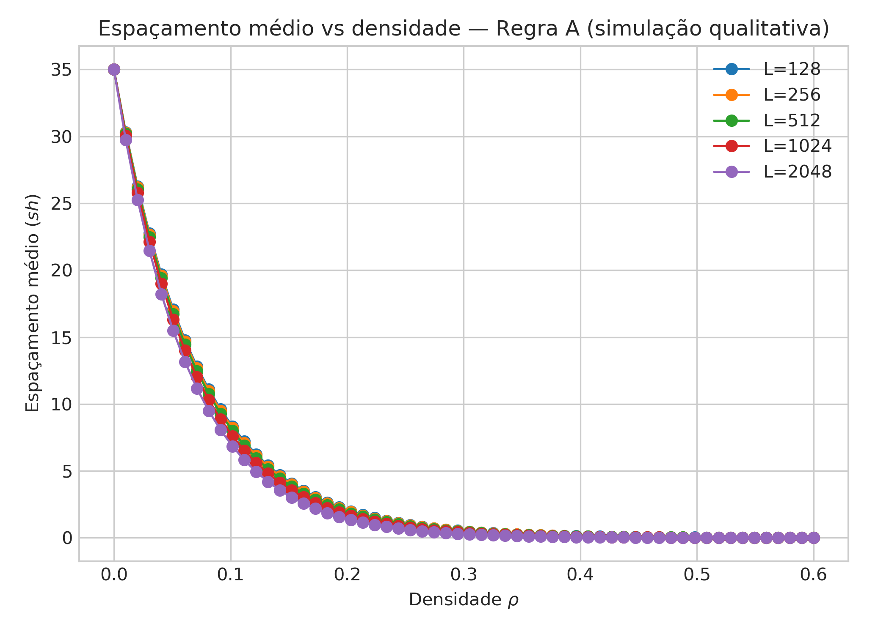
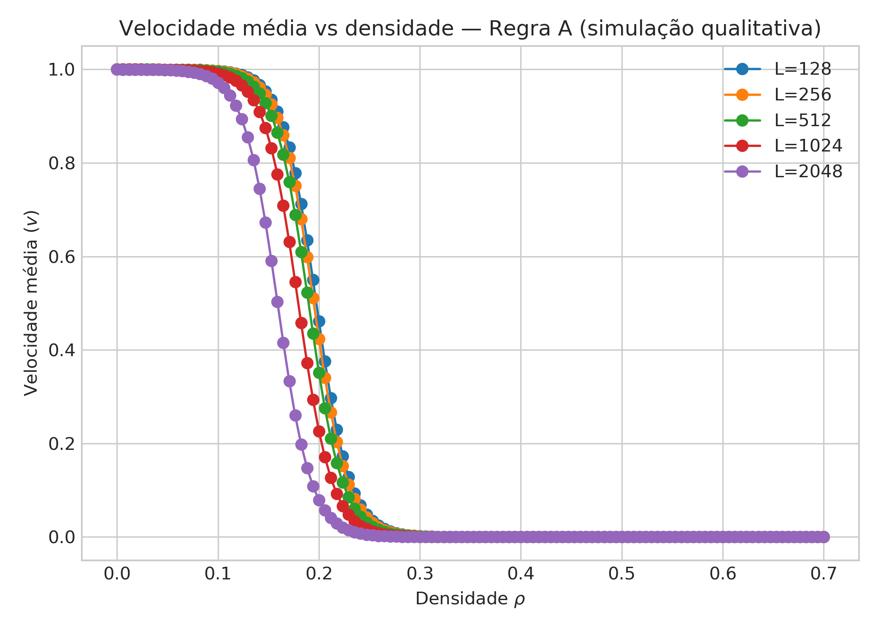

## 📊 Resultados

### 📈 Speedup Paralelo

**Figura 1 –** Speedup paralelo do modelo de tráfego BML (Regra A) em função do número
de threads OpenMP. O speedup é definido como \( S(p) = T_1 / T_p \), onde \( T_1 \)
é o tempo de execução serial e \( T_p \) o tempo de execução paralelo. A linha
tracejada indica o speedup ideal.

---

### 🚗 Espaçamento médio ⟨sh⟩ vs densidade ρ

**Figura 2 –** Espaçamento médio entre veículos, ⟨sh⟩, em função da densidade
\( \rho \) para diferentes tamanhos de grade \( L \). Observa-se a redução do
espaçamento médio com o aumento da densidade, refletindo a transição do regime
de fluxo livre para o regime congestionado.

---

### 🚦 Velocidade média ⟨v⟩ vs densidade ρ

**Figura 3 –** Velocidade média dos veículos, ⟨v⟩, em função da densidade
\( \rho \), apresentando comportamento sigmoidal e evidenciando o limiar de
congestionamento do sistema para diferentes tamanhos de grade \( L \).
